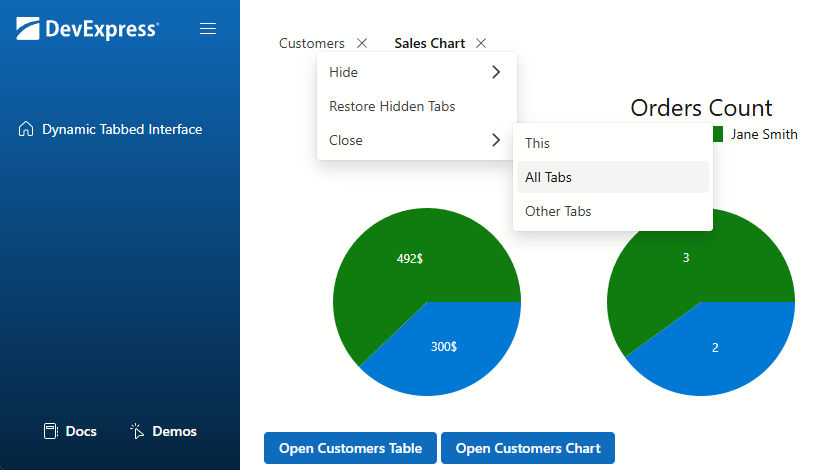

<!-- default badges list -->

[](https://supportcenter.devexpress.com/ticket/details/T1288385)
[](https://docs.devexpress.com/GeneralInformation/403183)
[](#does-this-example-address-your-development-requirementsobjectives)
<!-- default badges end -->
# Blazor Tabs - Create a Dynamic Tabbed Interface

The example creates an interactive, multi-tab web interface using DevExpress Blazor [Tabs](https://docs.devexpress.com/Blazor/405074/components/layout/tabs) and [Context Menu](https://docs.devexpress.com/Blazor/405060/components/navigation-controls/context-menu) components.



It illustrates how end users can create personalized workspaces and multitask effectively.

## Implementation Details

### Organize Content Into Tabs

The [MdiTabs](CS/blazor_multi_tab_ui/Components/MDI/MdiTabs.razor) custom component is based on [DxTabs](https://docs.devexpress.com/Blazor/DevExpress.Blazor.DxTabs) control.

Tabs are iteratively rendered from a persisted state collection (see details below). The content within each tab is loaded dynamically using a [DynamicComponent](https://learn.microsoft.com/en-us/dotnet/api/microsoft.aspnetcore.components.dynamiccomponent). This approach allows for the flexible rendering of different components within the tabs without the need to hardcode them.

```razor
<DxTabs ActiveTabIndex=activeTabIndex
        ActiveTabIndexChanged="OnActiveTabIndexChanged"
        AllowTabReorder="true"
        TabReordering="OnTabReordering"
        TabClosing="OnTabClosing"
        RenderMode="TabsRenderMode.Default">
    @for (int i = 0; i < tabsCollection.Count; i++)
    {
        var tabModel = tabsCollection[i];
        <DxTabPage  AllowClose="true"
                    CssClass="@TabCssClass"
                    VisibleIndex="@tabModel.VisibleIndex"
                    Visible="@tabModel.Visible"
                    Text="@tabModel.Text">
            <ChildContent>
                @if (stateService.TryGetType(tabModel.TabTypeName, out var type))
                {
                    <DynamicComponent @key="@tabModel.Id" Type="type" Parameters="tabModel.Parameters" />
                }
                else
                {
                    <DynamicComponent @key="@tabModel.Id" Type="@typeof(Unknown)" />
                }

            </ChildContent>
        </DxTabPage>
    }
</DxTabs>
```

### Persist Tab State

The state of the multi-tab interface is managed by the following classes:

- `MdiTabModel` ([MdiTabModel.cs](CS/blazor_multi_tab_ui/Models/MdiTabModel.cs)) encapsulates properties associated with each individual tab: unique identifier, visibility, title, and so on.
- `MdiStateModel` ([MdiStateModel.cs](CS/blazor_multi_tab_ui/Models/MdiStateModel.cs)) contains the list of all tabs (`MdiTabModel`) and the index of the active tab.
- `MdiStateService` ([MdiStateService.cs](CS/blazor_multi_tab_ui/Services/MdiStateService.cs)) exposes methods for tab state management and maintains tab layout across sessions even after the user closes and reopens the browser. It serializes `MdiStateModel` to JSON and saves it to the browser's local storage every time the UI layout changes. Tab state is restored in the `OnInitializedAsync` method of the `MdiTabs` component.

To ensure the state model (`MdiStateModel`) accurately reflects the live interface, implement event handlers for `TabReorder`, `TabClosing`, and `ActiveTabIndexChanged`. These handlers will listen for user actions and dynamically update the state to match the current tab layout.

### Add Context Menu to Tabs

Implement a context menu that allows users to manage tabs as needed:

- **Close** the current tab.
- **Close** all tabs.
- **Close** all tabs except for the current one.
- **Hide** the current tab.
- **Hide** all tabs.
- **Hide** all tabs except for the current one.
- **Restore** hidden tabs.

Create a custom [`TabsContextMenu`](CS/blazor_multi_tab_ui/Components/MDI/TabsContextMenu.razor) component which contains [DxContextMenu](https://docs.devexpress.com/Blazor/DevExpress.Blazor.DxContextMenu) and all related actions. Place it inside the `MdiTabs` component.

```razor
<TabsContextMenu @ref="contextMenu" TabSelector=@($".{TabCssClass}") />
```

Use the `TabSelector` parameter to associate the specific tab with the context menu.

Implement a client-side script [`TabsContextMenu.razor.js`](CS/blazor_multi_tab_ui/Components/MDI/TabsContextMenu.razor.js) that handles right-clicks on tabs and performs the following actions:

- Find the matching elements by their `CssClass` property.
- Suppress the default browser context menu.
- Capture the mouse position, and invoke a .NET `[JSInvokable]` method that opens the context menu at the pointer's coordinates.

When a menu item is clicked, the handler calls the corresponding method of [`MdiStateService`](CS/blazor_multi_tab_ui/Services/MdiStateService.cs) to update the tab state (close, hide, or restore).

## Files to Review

- [`MdiTabs.razor`](CS/blazor_multi_tab_ui/Components/MDI/MdiTabs.razor)
- [`MdiTabModel.cs`](CS/blazor_multi_tab_ui/Models/MdiTabModel.cs)
- [`MdiStateModel.cs`](CS/blazor_multi_tab_ui/Models/MdiStateModel.cs)
- [`MdiStateService.cs`](CS/blazor_multi_tab_ui/Services/MdiStateService.cs)
- [`TabsContextMenu.razor`](CS/blazor_multi_tab_ui/Components/MDI/TabsContextMenu.razor)
- [`TabsContextMenu.razor.js`](CS/blazor_multi_tab_ui/Components/MDI/TabsContextMenu.razor.js)

## Documentation

- [DxTabs Class](https://docs.devexpress.com/Blazor/DevExpress.Blazor.DxTabs)
- [DxTabPage Class](https://docs.devexpress.com/Blazor/DevExpress.Blazor.DxTabPage)
- [DxContextMenu Class](https://docs.devexpress.com/Blazor/DevExpress.Blazor.DxContextMenu)
- [DxContextMenuItem Class](https://docs.devexpress.com/Blazor/DevExpress.Blazor.DxContextMenuItem)

## More Examples

- [Form Layout for Blazor - Tabbed Wizard](https://github.com/DevExpress-Examples/Form-Layout-for-Blazor-Tabbed-Wizard)

<!-- feedback -->
## Does this example address your development requirements/objectives?

[](https://www.devexpress.com/support/examples/survey.xml?utm_source=github&utm_campaign=blazor-multi-tab-ui&~~~was_helpful=yes) [](https://www.devexpress.com/support/examples/survey.xml?utm_source=github&utm_campaign=blazor-multi-tab-ui&~~~was_helpful=no)

(you will be redirected to DevExpress.com to submit your response)
<!-- feedback end -->
